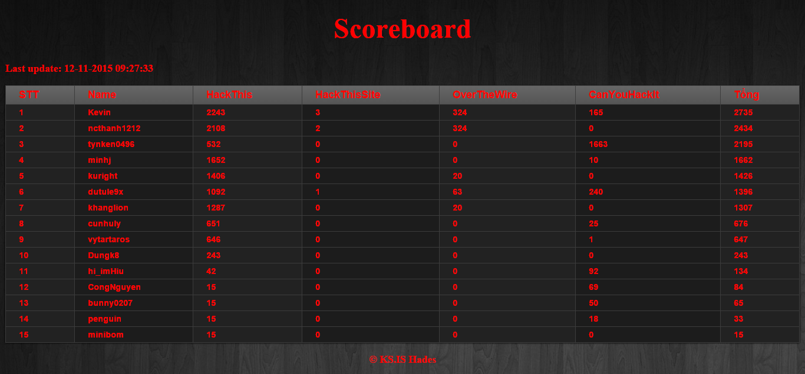

<pre>
 _   _           _           _____ ___________ _____                    _                         _ 
| | | |         | |         /  __ \_   _|  ___/  ___|                  | |                       | |
| |_| | __ _  __| | ___  ___| /  \/ | | | |_  \ `--.  ___ ___  _ __ ___| |__   ___   __ _ _ __ __| |
|  _  |/ _` |/ _` |/ _ \/ __| |     | | |  _|  `--. \/ __/ _ \| '__/ _ \ '_ \ / _ \ / _` | '__/ _` |
| | | | (_| | (_| |  __/\__ \ \__/\ | | | |   /\__/ / (_| (_) | | |  __/ |_) | (_) | (_| | | | (_| |
\_| |_/\__,_|\__,_|\___||___/\____/ \_/ \_|   \____/ \___\___/|_|  \___|_.__/ \___/ \__,_|_|  \__,_|
                                     </pre>
============================================================================
The Hades-CTF-Scoreboard is a version like [WeChall](https://www.wechall.net/) to auto update scoreboard of members.

__Contributors:__ 

Thong Nguyen ([@hades](https://www.facebook.com/57b5536fe3f256bb7ce318d48df528ff))

Toan ([@hardwork](https://github.com/toan-ksis)) 

__Installation tips:__ 

* You will need to setup some LAMP (linux apache mysql php) / WAMP (win apache mysql php) environment to run the php scripts provided and the mysql database.

* One you'll create the "score" database, you must execute the sql queries provided in "score_board.sql" file to create all the tables required.

__Supported Platforms:__ PHP 5.4.x & MySQL 4.4.x

__Screen:__ 

